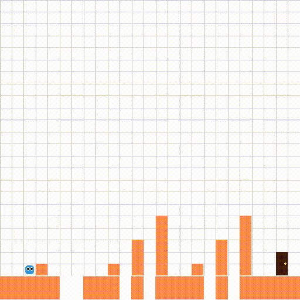

# 🎮 Reinforcement Learning with Pico Park

A single-agent [Gymnasium](https://gymnasium.farama.org/) environment inspired by [Pico Park](https://store.steampowered.com/app/1325900/Pico_Park/), plus scripts to train a DQN agent to clear procedurally generated obstacle courses.



## Highlights

- **Custom Gymnasium env** (`PicoPark-v0`) with platformer-style physics: jumping, gravity, platform collisions, and pit fall-outs.
- **Procedural levels** — each episode chains 2–3 randomly sampled challenge templates (ascending platforms, stairs, wall-and-drop, gaps, tall walls).
- **Compact obs space** built for a small MLP: agent / target positions, vertical velocity, and an encoding of the next obstacle ahead.
- **DQN baseline** (Stable-Baselines3) that trains end-to-end and saves rollout videos.
- **Play mode** so you can pilot the agent yourself with WASD / arrows.

## ℹ️ Overview

`PicoPark-v0` is a 25×25 grid platformer. The agent spawns on the left, a door spawns on the right, and 2–3 procedurally generated challenges sit between them. Reach the door to win, fall into a pit to lose, run out of steps to lose. The action space is `MultiDiscrete([3, 2])` (horizontal direction × jump button); the observation is a `Dict` with `agent`, `target`, `vy`, and a 3-tuple `next_obstacle = [kind, dx, size]` so a small policy can react without seeing the full level.

The training script wraps the env with a `Discrete(6)` adapter (DQN doesn't support `MultiDiscrete`) and trains a `MultiInputPolicy` for 500k steps. `watch.py` then rolls out 15 deterministic episodes and writes [`trained_agent.mp4`](trained_agent.mp4).

## Usage

Train a DQN agent (500k steps, takes a while):

```bash
python train.py
```

Roll out the trained agent and dump an MP4:

```bash
python watch.py     # writes trained_agent.mp4
```

Play the env yourself:

```bash
python play.py
```

Controls: `A`/`D` or `←`/`→` to move, `W`/`↑`/`Space` to jump, `R` to reset, `Esc` to quit.

Use the env directly:

```python
import gymnasium as gym
import PicoPark_v0  # registers PicoPark-v0

env = gym.make("PicoPark-v0", render_mode="human")
obs, info = env.reset(seed=0)
obs, reward, terminated, truncated, info = env.step(env.action_space.sample())
```

## Installation

Requires Python 3.10+.

```bash
git clone https://github.com/nolixn/FirstEnv.git
cd FirstEnv
pip install -e .
pip install stable-baselines3 imageio[ffmpeg] tqdm rich
```

`pip install -e .` installs the `PicoPark_v0` package (which registers `PicoPark-v0` on import). The second line pulls in DQN, MP4 writing, and progress-bar deps used by the training scripts.


